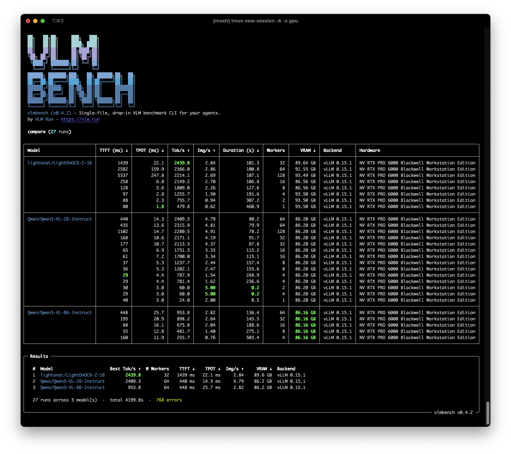

<div align="center">
<p align="center" style="width: 100%;">
    <br>
</p>
<h2>vlmbench</h2>
<p><b>Single-file, drop-in VLM benchmark CLI for your agents.</b></p>
<p align="center">
<a href="https://pypi.org/project/vlmbench/"></a>
<a href="https://pypi.org/project/vlmbench/"></a>
<a href="https://www.pepy.tech/projects/vlmbench"></a><br>
<a href="https://github.com/vlm-run/vlmbench/blob/main/LICENSE"></a>
<a href="https://discord.gg/AMApC2UzVY"></a>
<a href="https://twitter.com/vlmrun"></a>
</p>
</div>

Benchmark any vision-language model on your own hardware with a single command. vlmbench auto-detects your platform, starts the right backend, and gives you reproducible results as JSON.

- [**Ollama**](https://ollama.com) on **macOS**: auto-starts, zero config
- [**vLLM**](https://docs.vllm.ai) on **Linux**: via Docker (`--gpus all`, auto-pulls) or native vLLM
- [**SGLang**](https://github.com/lmsysorg/sglang) on **Linux**: coming soon



## Quick Start

No install needed — just run with [`uvx`](https://docs.astral.sh/uv/):

```bash
# macOS (Ollama — auto-starts, auto-pulls the model)
uvx vlmbench run -m qwen3-vl:2b -i ./images/

# Linux (vLLM Docker — auto-starts with --gpus all)
uvx vlmbench run -m Qwen/Qwen3-VL-8B-Instruct -i ./images/

# Linux (native vLLM — requires vllm installed)
uvx vlmbench run -m Qwen/Qwen3-VL-8B-Instruct -i ./images/ --backend vllm
```

Or install it:

```bash
pip install vlmbench
```

## Example Run

```
╭─ Configuration ──────────────────────────────────────────────────────────────╮
│                                                                              │
│   Model      lightonai/LightOnOCR-2-1B @ main                                │
│   Server     http://localhost:8000/v1 • vLLM 0.15.1                          │
│   Hardware   NVIDIA RTX PRO 6000 • CUDA • 95.59 GB VRAM                      │
│   Input      ./docs/ -> 62 inputs (43 images, 19 PDF pages)                  │
│   Config     max_tokens=2048 • runs=3 • concurrency=8                        │
│   Tmux       vlmbench-vllm • tmux attach -t vlmbench-vllm                    │
│                                                                              │
╰──────────────────────────────────────────────────────────────────────────────╯

╭─ Results ────────────────────────────────────────────────────────────────────╮
│                                                                              │
│   TTFT           467 ms    (p95: 1975 ms)                                    │
│   TPOT           6.0 ms    (p95: 6.2 ms)                                     │
│   Throughput   1664.8 tok/s
│   Latency        0.87 s/img  (p95: 3.55 s)                                   │
│   Tokens          270 prompt    181 completion (avg)                         │
│   Reliability  186/186 ok, 0 retries                                         │
│                                                                              │
╰──────────────────────────────────────────────────────────────────────────────╯
  > Saved -> results/lightonocr-2-1b-20260207T104621.json
```

## Behind the Scenes

When you run `uvx vlmbench run`, here's what happens automatically:

1. **Detects your platform**: macOS routes to Ollama, Linux to vLLM Docker
2. **Pulls the Docker image**: `docker pull vllm/vllm-openai:latest` (cached after first run)
3. **Starts the server in tmux**: `docker run --gpus all` in a named tmux session (`vlmbench-vllm`)
4. **Launches a GPU monitor**: `nvitop` (Linux) or `macmon` (macOS) in a split pane
5. **Waits for the server**: polls `/v1/models` until ready (up to 600s for large models)
6. **Runs warmup requests**: fail-fast validation before timed runs
7. **Benchmarks with concurrency**: streams completions via the OpenAI API, measures TTFT/TPOT/throughput
8. **Saves results as JSON**: one file per run in `./results/`, ready for `vlmbench compare`

Attach to the live session anytime with `tmux attach -t vlmbench-vllm`.

<details>
<summary><b>tmux session capture</b> — server logs + GPU monitor side by side</summary>

**Top pane — vLLM server logs:**

```
(APIServer pid=1) INFO 02-07 15:44:24 non-default args: {
  'model': 'lightonai/LightOnOCR-2-1B',
  'enable_prefix_caching': False,
  'limit_mm_per_prompt': {'image': 1},
  'mm_processor_cache_gb': 0.0
}
(APIServer pid=1) INFO 02-07 15:44:34 Resolved architecture: LightOnOCRForConditionalGeneration
(APIServer pid=1) INFO 02-07 15:44:34 Using max model len 16384
(EngineCore pid=272) INFO 02-07 15:44:44 Initializing a V1 LLM engine (v0.15.1) with config:
  model='lightonai/LightOnOCR-2-1B', dtype=torch.bfloat16, max_seq_len=16384,
  tensor_parallel_size=1, quantization=None
(EngineCore pid=272) INFO 02-07 15:45:41 Loading weights took 0.49 seconds
(EngineCore pid=272) INFO 02-07 15:45:42 Model loading took 1.88 GiB memory and 22.15 seconds
(EngineCore pid=272) INFO 02-07 15:46:11 Available KV cache memory: 77.94 GiB
(EngineCore pid=272) INFO 02-07 15:46:11 Maximum concurrency for 16,384 tokens per request: 44.53x
Capturing CUDA graphs (decode, FULL): 100% |██████████| 51/51
(APIServer pid=1) INFO Started server process [1]
(APIServer pid=1) INFO Application startup complete.
(APIServer pid=1) INFO 172.17.0.1 - "POST /v1/chat/completions HTTP/1.1" 200 OK
```

**Bottom pane — nvitop GPU monitor:**

```
NVITOP 1.6.2      Driver Version: 580.126.09      CUDA Driver Version: 13.0
╒═══════════════════════════════╤══════════════════════╤══════════════════════╕
│ GPU  Name        Persistence-M│ Bus-Id        Disp.A │ Volatile Uncorr. ECC │
│ Fan  Temp  Perf  Pwr:Usage/Cap│         Memory-Usage │ GPU-Util  Compute M. │
╞═══════════════════════════════╪══════════════════════╪══════════════════════╡
│   0  GeForce RTX 2080 Ti  Off │ 00000000:21:00.0 Off │                  N/A │
│ 27%   42C   P8     17W / 250W │  107.2MiB / 11264MiB │      0%      Default │
├───────────────────────────────┼──────────────────────┼──────────────────────┤
│   1  RTX PRO 6000         Off │ 00000000:4B:00.0 Off │                  N/A │
│ 30%   33C   P1     66W / 600W │  86.54GiB / 95.59GiB │      0%      Default │
╘═══════════════════════════════╧══════════════════════╧══════════════════════╛
  MEM: ███████████████████████████████████████████████████████████▏ 90.5%
  Load Average: 4.14  2.73  1.65
```

</details>

## Compare

```bash
uvx vlmbench compare results/*.json
```

```
╭───────────────────────────────┬──────────┬──────────┬─────────┬────────┬──────────────┬─────────────┬──────────┬────────────┬──────────────────────────────────────────────────────╮
│                               │     TTFT │     TPOT │         │        │ Duration (s) │ num_workers │     VRAM │            │                                                      │
│ Model                         │     (ms) │     (ms) │ Tok/s ↓ │  Img/s │              │             │          │ Backend    │ Hardware                                             │
├───────────────────────────────┼──────────┼──────────┼─────────┼────────┼──────────────┼─────────────┼──────────┼────────────┼──────────────────────────────────────────────────────┤
│ lightonai/LightOnOCR-2-1B     │      467 │      6.0 │  1664.8 │   9.20 │        162.4 │           8 │  5.78 GB │ vLLM 0.15.1│ NVIDIA RTX PRO 6000 Blackwell Workstation Edition    │
├───────────────────────────────┼──────────┼──────────┼─────────┼────────┼──────────────┼─────────────┼──────────┼────────────┼──────────────────────────────────────────────────────┤
│ rednote-hilab/dots.ocr        │     1424 │     10.2 │   477.6 │   7.76 │        190.8 │           8 │  9.42 GB │ vLLM 0.15.1│ NVIDIA RTX PRO 6000 Blackwell Workstation Edition    │
├───────────────────────────────┼──────────┼──────────┼─────────┼────────┼──────────────┼─────────────┼──────────┼────────────┼──────────────────────────────────────────────────────┤
│ Qwen/Qwen3-VL-8B-Instruct-FP8 │      698 │     17.2 │   461.6 │   6.40 │        232.0 │           8 │ 11.75 GB │ vLLM 0.15.1│ NVIDIA RTX PRO 6000 Blackwell Workstation Edition    │
├───────────────────────────────┼──────────┼──────────┼─────────┼────────┼──────────────┼─────────────┼──────────┼────────────┼──────────────────────────────────────────────────────┤
│ Qwen/Qwen3-VL-8B-Instruct     │      638 │     17.9 │   448.0 │   6.40 │        233.6 │           8 │ 17.41 GB │ vLLM 0.15.1│ NVIDIA RTX PRO 6000 Blackwell Workstation Edition    │
╰───────────────────────────────┴──────────┴──────────┴─────────┴────────┴──────────────┴─────────────┴──────────┴────────────┴──────────────────────────────────────────────────────╯

╭─ Summary ────────────────────────────────────────────────────────────────────╮
│  Runs       4 across 4 model(s)  total duration 818.8s                       │
│  Tok/s      1664.8 best   448.0 worst   763.0 avg                            │
│  Errors     0                                                                │
╰──────────────────────────────────────────────────────────── vlmbench v0.1.0 ─╯
```

## Usage

### Mac + Ollama

```bash
uvx vlmbench run -m qwen3-vl:2b -i ./images/
uvx vlmbench run -m glm-ocr:latest -i ./images/
```

### Linux + vLLM (Docker)

```bash
# Auto-starts vLLM via Docker with --gpus all (HuggingFace model IDs)
uvx vlmbench run -m Qwen/Qwen3-VL-2B-Instruct -i ./images/

# Nightly Docker image
uvx vlmbench run -m PaddlePaddle/PaddleOCR-VL-1.5 -i ./images/ \
  --backend vllm-openai:nightly

# Concurrency for throughput testing
uvx vlmbench run -m Qwen/Qwen3-VL-8B-Instruct -i ./images/ \
  --max-concurrency 8 --runs 3
```

### Linux + vLLM (native)

```bash
# Requires vllm installed (pip install vllm)
uvx vlmbench run -m Qwen/Qwen3-VL-2B-Instruct -i ./images/ --backend vllm
```

### Cloud API

```bash
uvx vlmbench run -m Qwen/Qwen3-VL-2B-Instruct -i ./images/ \
  --base-url https://api.openai.com/v1 --api-key $OPENAI_API_KEY
```

### Compare

```bash
uvx vlmbench compare results/*.json
```

## CLI Flags

| Flag | Default | Description |
|---|---|---|
| `--model` / `-m` | required | Model ID (vLLM: `Qwen/Qwen3-VL-2B-Instruct`, Ollama: `qwen3-vl:2b`) |
| `--input` / `-i` | required | File or directory (images, PDFs, videos) |
| `--base-url` | auto-detect | OpenAI-compatible base URL |
| `--api-key` | `no-key` | API key (also reads `OPENAI_API_KEY` env) |
| `--prompt` | `"Extract all text..."` | Prompt sent with each input |
| `--max-tokens` | `2048` | Max completion tokens |
| `--runs` | `3` | Timed runs per input |
| `--warmup` | `1` | Warmup runs (not recorded, fail-fast on errors) |
| `--max-concurrency` | `1` | Max parallel requests |
| `--save` | `./results/` | Output directory |
| `--backend` | `auto` | `auto`, `ollama`, `vllm` (native), `vllm-openai:<tag>` (Docker), `sglang:<tag>` |
| `--serve/--no-serve` | `--serve` | Auto-start server if none detected |
| `--serve-args` | none | Extra args passed to server (Docker or native) |
| `--tag` | none | Custom grouping label |
| `--quant` | `auto` | Quantization metadata: `fp16`, `bf16`, `q4_K_M`, etc. |
| `--revision` | `main` | Model revision metadata |

## Backends

| `--backend` | Resolves to | Serving |
|---|---|---|
| `auto` | `ollama` on macOS, `vllm-openai:latest` on Linux | Native / Docker |
| `ollama` | Ollama native | `ollama serve` in tmux |
| `vllm` | Native vLLM | `vllm serve` in tmux |
| `vllm-openai:latest` | `vllm/vllm-openai:latest` | `docker run --gpus all` |
| `vllm-openai:nightly` | `vllm/vllm-openai:nightly` | `docker run --gpus all` |
| `sglang:latest` | `lmsysorg/sglang:latest` | `docker run --gpus all` (coming soon) |

All Docker backends run with `--gpus all --ipc=host` and a deterministic container name (`vlmbench-vllm-openai`, `vlmbench-sglang`) for easy log access.

## Monitoring

Every run starts a tmux session with two panes:

- **Top**: server logs (`tail -f ~/.ollama/logs/server.log` or `docker logs -f`)
- **Bottom**: GPU monitor (`macmon` on macOS, `nvitop` on Linux)

Attach with `tmux attach -t vlmbench-vllm`.

## Supported Models

See [MODELS.md](.claude/skills/vlmbench/MODELS.md) for tested models and their required `--serve-args`.

## Input Types

| Type | Extensions | Processing |
|---|---|---|
| Image | `.png`, `.jpg`, `.jpeg`, `.webp`, `.tiff`, `.bmp` | Base64 encode |
| PDF | `.pdf` | `pypdfium2` per-page -> base64 |
| Video | `.mp4`, `.mov`, `.avi`, `.mkv`, `.webm` | `ffmpeg` 1fps -> frames -> base64 |

Directories processed recursively, sorted alphabetically.

## Output

Results saved as JSON to `./results/{model-slug}-{timestamp}.json` with model metadata, environment info, benchmark stats (TTFT, TPOT, throughput, latency percentiles), and raw per-run data.

## Requirements

**Core:**
- Python >= 3.11
- [uv](https://docs.astral.sh/uv/) (recommended)

**Linux (vLLM/SGLang Docker backends):**
- Docker + NVIDIA GPU support
- Native vLLM: `uv pip install vllm`

**Monitoring:**
- `tmux`: server management and session control
- `nvitop` (Linux) or `macmon` (macOS, `brew install macmon`)

**Optional:**
- `ffmpeg`: video frame extraction
